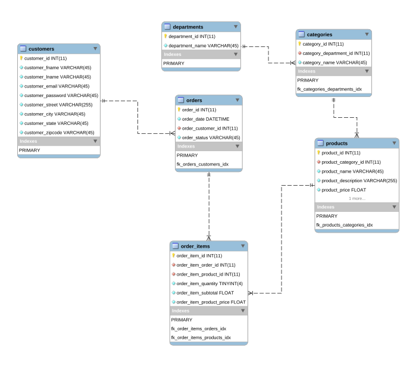

#Data warehouse en Spark

Apartir de la base de datos retail_db contenida en mysql la cual accesamos por medio de una maquina virtual de cloudera crear un data warehouse en spark:

* La tabla de hechos la tabla de hechos tiene la cantidad de productos vendidos, el valor de las ventas y fecha de carga de los registros. Las dimensiones del esquema en estrella deben ser las siguientes: 

* Cliente: Esta dimensión debe tener una columna que almacena el correo electrónico del cliente. La estructura de la columna es fname. lname@upb.{city}.com. Adicionalmente construya una columna de password cuyo valor es un número aleatorio entre 0 y 100. 

* Estado del pago

* Categoría 

* Producto

* Departamento

* Ciudad

* Tiempo: Esta dimensión debe tener una columna que muestre el dıa de la semana, el d ́ıa del mes, el mes, el trimestre y el sementre en que se realizó la compra. 

# 1. Modelo Entidad Relación de la base de datos Mysql



## 2. Arquitectura a utilizar


## 3. Realizar la conexión de Mysql a Spark para crear las tablas en *.parquet.

```scala
val sqlContext = new org.apache.spark.sql.SQLContext(sc)
var url="jdbc:mysql://quickstart:3306/retail_db"
val pro= new java.util.Properties
pro.setProperty("user","root")
pro.setProperty("password","cloudera")
```
# Retail_db, Apache-Spark

Creacion de modelo en estrella utilizando Apache-Spark y MySql.


