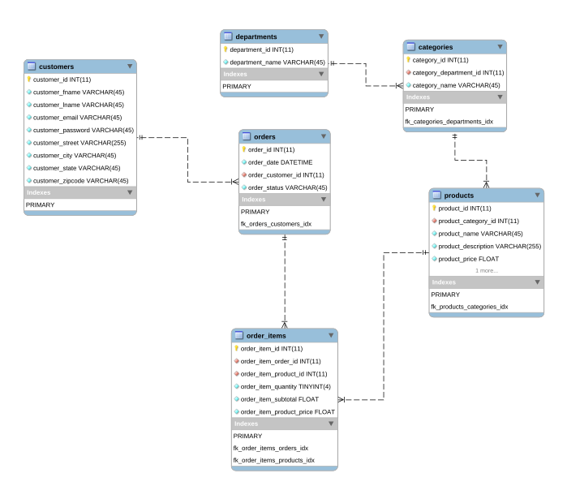
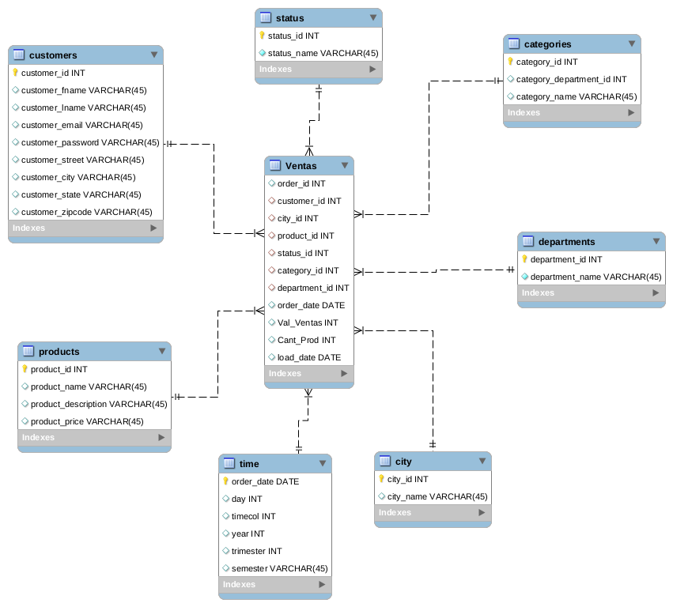
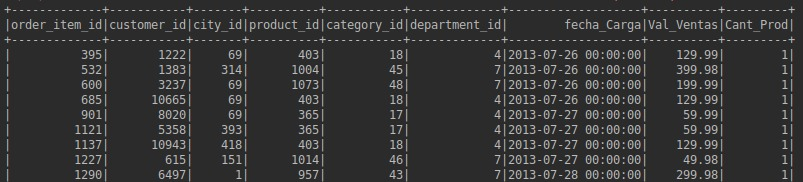
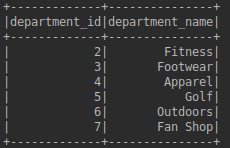
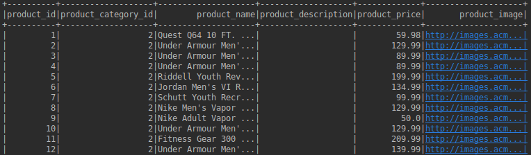
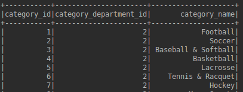
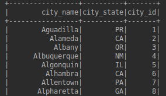

# Data warehouse en Spark

Apartir de la base de datos retail_db contenida en mysql la cual accesamos por medio de una maquina virtual de cloudera crear un data warehouse en spark:

## 1. Proceso de cargar de tablas desde Mysql a archivos parquet en Hadoop

### 1.1 Conectando Apache-Spark a Mysql
```scala
val sqlContext = new org.apache.spark.sql.SQLContext(sc)
var url="jdbc:mysql://quickstart:3306/retail_db"
val pro= new java.util.Properties
prop.put("user", USR_MYSQL)
prop.put("password", PWD_MYSQL)

```
### 1.2 Lectura de tablas de MySql desde Apache-Spark y escritura de archivos parquet en Hadoop

```scala
def cargarTablas(): Unit ={

      var tablas = Array("departments", "categories", "customers", "order_items", "orders", "products")

      tablas.foreach(e => transformarMysqlTable_ParquetFile(e, DATAWAREHOUSE))

    }
    private def transformarMysqlTable_ParquetFile(tableName :String, urlDfs :String): Unit ={
      val prop = new Properties()
      prop.put("user", USR_MYSQL)
      prop.put("password", PWD_MYSQL)
      var table: String = "retail_db."+tableName
      var urlD: String = urlDfs+tableName+PARQUET_EXT
      var dataFrm: DataFrame = sqlContext.read.jdbc(URL_MYSQL, table, prop)
      dataFrm.write.mode("overwrite").format("parquet").save(urlD)
    }


```

### 1.3 Lectura de los archivos *.parquet 

```scala
val parquetdepar = sqlContext.read.parquet("/datawh/department.parquet")
val parquetcliente = sqlContext.read.parquet("/datawh/customers.parquet")
val parquetcategoria = sqlContext.read.parquet("/datawh/categories.parquet")
val parquetproducto = sqlContext.read.parquet("/datawh/products.parquet")
val parquetorder_items = sqlContext.read.parquet("/datawh/order_items.parquet")
val parquetorders = sqlContext.read.parquet("/datawh/orders.parquet")
```

## 2. Modelo Entidad Relación de la base de datos Mysql



## 3. Arquitectura a utilizar


## 4. Modelo estrella 

Creacion de modelo en estrella utilizando Apache-Spark y MySql.

* La tabla de hechos la tabla de hechos tiene la cantidad de productos vendidos, el valor de las ventas y fecha de carga de los registros. Las dimensiones del esquema en estrella deben ser las siguientes: 
* Cliente: Esta dimensión debe tener una columna que almacena el correo electrónico del cliente. La estructura de la columna es fname. lname@upb.{city}.com. Adicionalmente construya una columna de password cuyo valor es un número aleatorio entre 0 y 100. 
* Estado del pago
* Categoría 
* Producto
* Departamento
* Ciudad
* Tiempo: Esta dimensión debe tener una columna que muestre el dıa de la semana, el d ́ıa del mes, el mes, el trimestre y el sementre en que se realizó la compra. 

### 4.1 Modelo Estrella Apache-Spark



## 5. Creción del tabla de Hechos

```scala
def crearNodoHechos(): Unit ={

      var departments: DataFrame = sqlContext.read.parquet(DATAWAREHOUSE+"departments"+PARQUET_EXT)
      departments.registerTempTable("departments")
      var categories: DataFrame = sqlContext.read.parquet(DATAWAREHOUSE+"categories"+PARQUET_EXT)
      categories.registerTempTable("categories")
      var customers: DataFrame = sqlContext.read.parquet(DATAWAREHOUSE+"customers"+PARQUET_EXT)
      customers.registerTempTable("customers")
      var order_items: DataFrame = sqlContext.read.parquet(DATAWAREHOUSE+"order_items"+PARQUET_EXT)
      order_items.registerTempTable("order_items")
      var orders: DataFrame = sqlContext.read.parquet(DATAWAREHOUSE+"orders"+PARQUET_EXT)
      orders.registerTempTable("orders")
      var products: DataFrame = sqlContext.read.parquet(DATAWAREHOUSE+"products"+PARQUET_EXT)
      products.registerTempTable("products")
      var cites: DataFrame = sqlContext.read.parquet(DATAMARK+"cites"+PARQUET_EXT)
      cites.registerTempTable("cites")
      val nodoHechos = sqlContext.sql(
        "select "+
          "(o.order_id) as order_id, "+
          "(c.customer_id) as customer_id, "+
          "(ci.city_id) as city_id, "+
          "(p.product_id) as product_id, "+
          "(ca.category_id) as category_id, "+
          "(d.department_id) as department_id, "+
          "(o.order_date) as order_date, "+
          "sum(oi.order_item_subtotal) as Val_Ventas, "+
          "sum(oi.order_item_quantity) as Cant_Prod "+
          "from "+
          "order_items oi, "+
          "orders o, "+
          "customers c, "+
          "products p, "+
          "categories ca, "+
          "departments d, "+
          "cites ci "+
          "where o.order_id = oi.order_item_order_id and "+
          "o.order_customer_id = c.customer_id and "+
          "c.customer_city = ci.city_name and "+
          "c.customer_state = ci.city_state and "+
          "oi.order_item_product_id = p.product_id and "+
          "ca.category_id = p.product_category_id and "+
          "ca.category_department_id = d.department_id "+
          "Group by "+
          "o.order_id, "+
          "c.customer_id, "+
          "ci.city_id, "+
          "p.product_id, "+
          "ca.category_id, "+
          "d.department_id, "+
          "o.order_date" )
        .withColumn("load_date", current_date())
      var urlD: String = DATAMARK+"hechos"+PARQUET_EXT
      nodoHechos.write.mode("overwrite").format("parquet").save(urlD)
    }
```

.jpg "Tabla de Hechos")


## 6. Se crean las dimensiones

### 6.1 Dimesión de Tiempo: 

#### Esta se puede realizar de formas utilizando las funcion withcolumn junto con las funciones de tiempo.

```scala
def crearNodoTiempo(): Unit ={
      var dataFrame: DataFrame = sqlContext.read.parquet(DATAWAREHOUSE+"orders"+PARQUET_EXT)
      def roundUp(d: Double) = math.ceil(d).toInt
      var nodoTiempo = dataFrame
        .selectExpr("(order_date) as date")
        .distinct()
        .withColumn("day",dayofmonth(col("date")))
        .withColumn("month",month(col("date")))
        .withColumn("year",year(col("date")))
        .withColumn("trimester", quarter(col("date")))
        .withColumn("semester", round(quarter(col("date"))/2))
      var urlD: String = DATAMARK+"timer"+PARQUET_EXT
      nodoTiempo.write.mode("overwrite").format("parquet").save(urlD)
    }
```



### 6.2 Dimensión de Customers


#### La dimensión contiene campos calculados de mail (lname@upb.{city}.com) y passwork entre 0 y 100.

```scala
 def crearNodoClientes(): Unit ={
      val readData: DataFrame = sqlContext.read.parquet(DATAWAREHOUSE + "customers" + PARQUET_EXT)
      def aleatorio = new scala.util.Random()
      val maxAleatorio = 100
      val nextRandomIntUdf = udf(() => aleatorio.nextInt(maxAleatorio))
      val nodoCliente = readData.selectExpr(
        "customer_id",
        "customer_fname",
        "customer_lname",
        "concat(customer_fname,'.',customer_lname,'@upb.',customer_city,'com') as customer_email",
        "customer_street",
        "customer_city",
        "customer_state",
        "customer_zipcode" )
        .withColumn("customer_password", nextRandomIntUdf())
      var urlD: String = DATAMARK+"customers"+PARQUET_EXT
      nodoCliente.write.mode("overwrite").format("parquet").save(urlD)
```

### 6.3 Dimensión departamento

```scala
def crearNodoDepartamentos(): Unit ={
var dataFrame: DataFrame = sqlContext.read.parquet(DATAWAREHOUSE+"departments"+PARQUET_EXT)
var nodoDepartamento = dataFrame
.selectExpr(
"department_id",
"department_name")
//nodoDepartamento.show(100)
var urlD: String = DATAMARK+"departments"+PARQUET_EXT
nodoDepartamento.write.mode("overwrite").format("parquet").save(urlD)
}
```


### 6.4 Dimensión productos
```scala
def crearNodoProductos(): Unit ={
      var dataFrame: DataFrame = sqlContext.read.parquet(DATAWAREHOUSE+"products"+PARQUET_EXT)
      var nodoProductos = dataFrame
        .selectExpr(
          "product_id",
          "product_category_id",
          "product_name",
          "product_description",
          "product_price",
          "product_image")
      var urlD: String = DATAMARK+"products"+PARQUET_EXT
      nodoProductos.write.mode("overwrite").format("parquet").save(urlD)

    }
```


### 6.5 Dimensión Categoria
```scala
def crearNodoCategortias(): Unit ={
var dataFrame: DataFrame = sqlContext.read.parquet(DATAWAREHOUSE+"categories"+PARQUET_EXT)
var nodoCategory = dataFrame
.selectExpr(
"category_id",
"category_department_id",
"category_name")
//nodoCategory.show(100)
var urlD: String = DATAMARK+"categories"+PARQUET_EXT
nodoCategory.write.mode("overwrite").format("parquet").save(urlD)
}
```


### 6.5 Dimensión Ciudad
```scala
def crearNodoCiudades(): Unit ={
val hiveContext = new org.apache.spark.sql.hive.HiveContext(sparkContext)
var dataFrame: DataFrame = hiveContext.read.parquet(DATAWAREHOUSE+"customers"+PARQUET_EXT)

var nodoCiudad = dataFrame
.selectExpr(
"(customer_city) as city_name",
"(customer_state) as city_state")
.distinct()
.withColumn("city_id",row_number().over(Window.orderBy("city_name")))
//nodoCiudad.show(100)
var urlD: String = DATAMARK+"cites"+PARQUET_EXT
nodoCiudad.write.mode("overwrite").format("parquet").save(urlD)
}
```


### 6.5 Dimensión Estado

```scala
def crearNodoEstados(): Unit ={
val hiveContext = new org.apache.spark.sql.hive.HiveContext(sparkContext)
var dataFrame: DataFrame = hiveContext.read.parquet(DATAWAREHOUSE+"orders"+PARQUET_EXT)
var nodoEstado = dataFrame
.selectExpr("(order_status) as status_name")
.distinct()
.withColumn("status_id", row_number().over(Window.orderBy("status_name")))
//nodoEstado.show(100) // Solo para entorno desarrollo
var urlD: String = DATAMARK+"status"+PARQUET_EXT
nodoEstado.write.mode("overwrite").format("parquet").save(urlD)
}

```


## 10. Compilación de codigo en IDE para obtener el *.JAR


